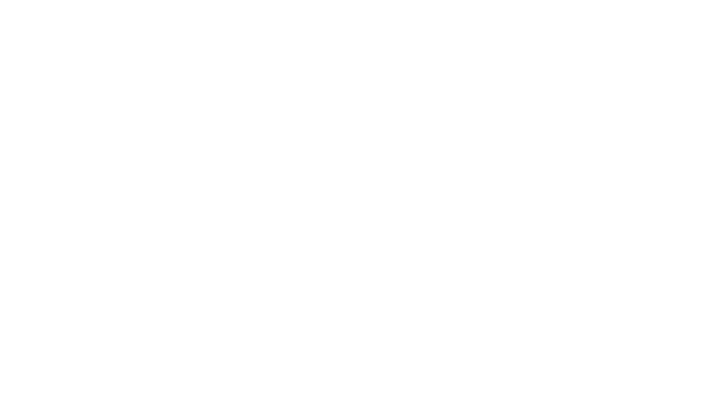

# SHOEXPORT

Este repositorio contiene información y recursos relacionados con el proceso de la creación de nuestra página sobre importación de zapatillas.

El logo del repositorio representa nuestra identidad y compromiso con la importación de zapatillas. Nuestro objetivo es proporcionar información relevante y recursos útiles para aquellos interesados en el negocio de importación de este tipo de calzado.

## Contenido

El repositorio se organiza en diferentes secciones y archivos que abarcan los siguientes temas:

- Guías de importación de zapatillas.
- Documentación legal y aduanera relacionada con la importación.
- Ejemplos y plantillas de documentos para facilitar el proceso.
- Recursos y enlaces útiles para obtener más información sobre la importación de zapatillas.

## Contribuciones

¡Agradecemos las contribuciones a este repositorio! Si deseas agregar o mejorar la información existente, puedes hacerlo mediante el envío de solicitudes de extracción (pull requests). Por favor, asegúrate de seguir nuestras pautas de contribución y etiquetado.

## Licencia

Este repositorio se distribuye bajo la Licencia MIT. Puedes obtener más detalles en el archivo [LICENSE](LICENSE).

## Contacto

Si tienes alguna pregunta, comentario o sugerencia, no dudes en ponerte en contacto con nosotros. Puedes enviar un correo electrónico a [arquinigofloressebastian@gmail.com](mailto:info@importacionzapatillas.com) o visitar nuestro sitio web [https://shoexport.vercel.app](https://shoexport.vercel.app).

¡Esperamos que encuentres útil este repositorio y que te sea de ayuda en tu proceso de importación de zapatillas!
